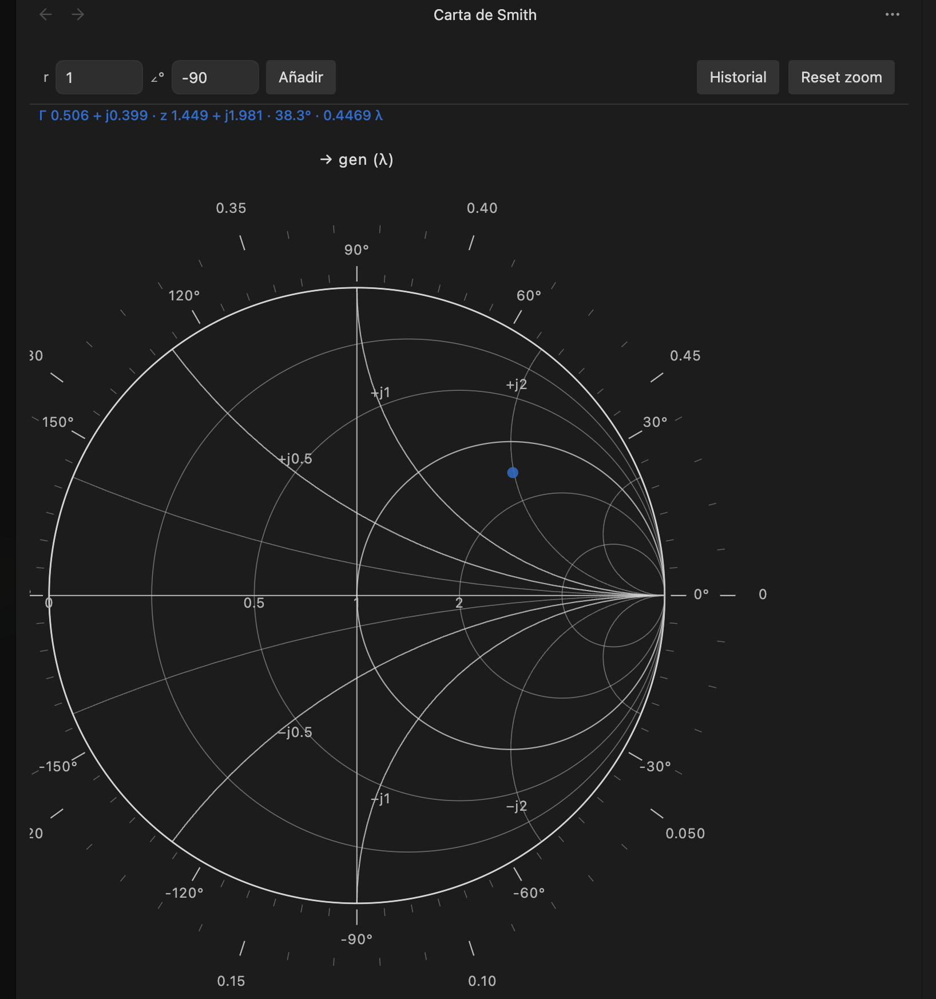
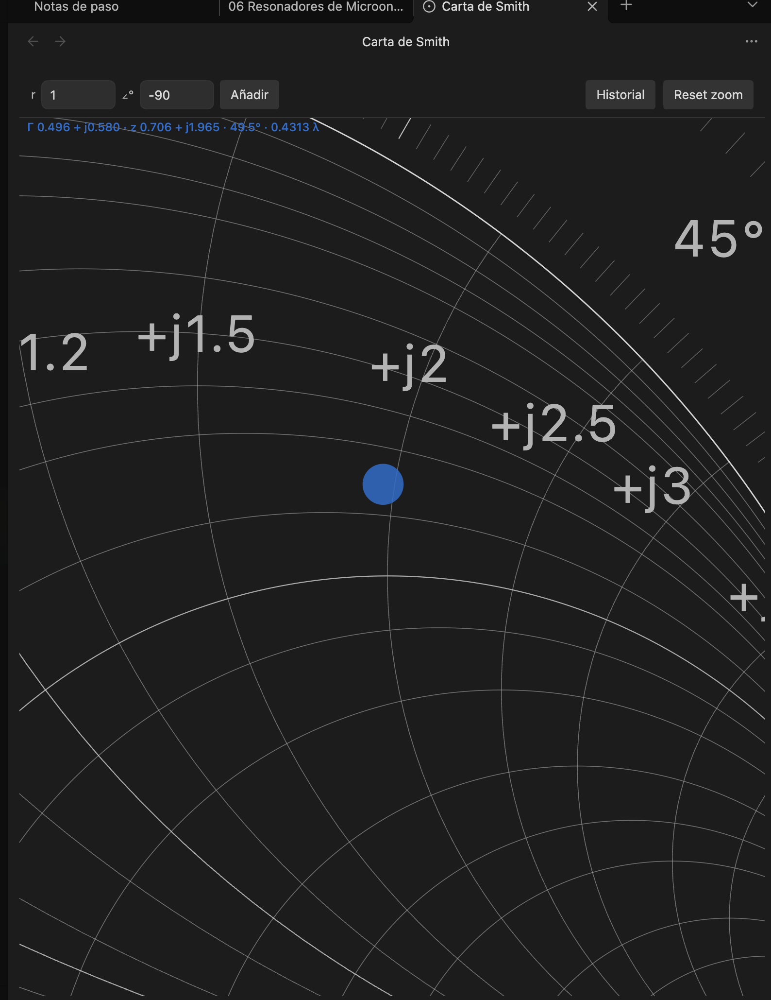
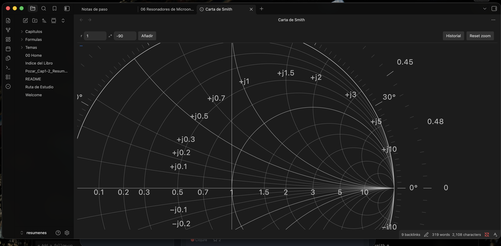

# Carta de Smith

Plugin de [Obsidian](https://obsidian.md) con una **vista interactiva** de la carta de Smith: SVG vectorial, zoom con cuadrícula adaptativa, colocación de puntos e historial de sesión. Se integra con el tema activo (sin fondo propio; trazos con el color del texto; puntos con el accent).



## Características

- Carta de Smith en SVG (círculos de *r*, arcos de *x*, escalas de ángulo y λ hacia generador)
- Zoom con rueda y pan arrastrando; la cuadrícula se densifica al acercar
- Lectura en vivo del cursor: Γ, *z*, ángulo y λ
- Click (o entrada polar) para fijar puntos; historial temporal (últimos 12, fade 6 s) y botón **Historial** de sesión
- Inputs **r** (0–1) y **∠°** (0–360) en la barra superior



## Instalación

### Desarrollo / uso local

```bash
npm install
npm run build
```

Enlaza o copia la carpeta del plugin al vault:

```bash
ln -s /ruta/a/smith_obsidian "<vault>/.obsidian/plugins/smith-chart"
```

En Obsidian: **Settings → Community plugins** → activa **Carta de Smith**, y recarga si hace falta.

### Abrir la vista

- Comando: **Abrir carta de Smith**
- O el icono del ribbon



## Uso

| Acción | Efecto |
|--------|--------|
| Rueda | Zoom (más detalle de grilla) |
| Arrastrar | Pan |
| Click en la carta | Fija un punto |
| **r** + **∠°** → Añadir | Punto por radio \|Γ\| y ángulo |
| **Historial** | Todos los puntos de la sesión |
| **Reset zoom** | Vista inicial |

Los puntos fijados aparecen en la esquina superior y se desvanecen en unos 6 segundos (máximo 12 visibles a la vez). Quedan guardados en el historial de la sesión hasta cerrar la vista o limpiarlo.

## Desarrollo

```bash
npm run dev    # watch con esbuild
npm run build  # producción
```

Estructura principal:

```
src/
  main.ts              # registro del plugin y comando
  view/SmithView.ts    # ItemView, HUD, inputs polares
  chart/SmithChart.ts  # SVG, zoom/pan, interacción
  chart/grid.ts        # cuadrícula r/x adaptativa
  chart/scales.ts      # escalas λ y ángulo
  math/smith.ts        # Γ ↔ z, polar
  history/PointHistory.ts
```

## Licencia

MIT
